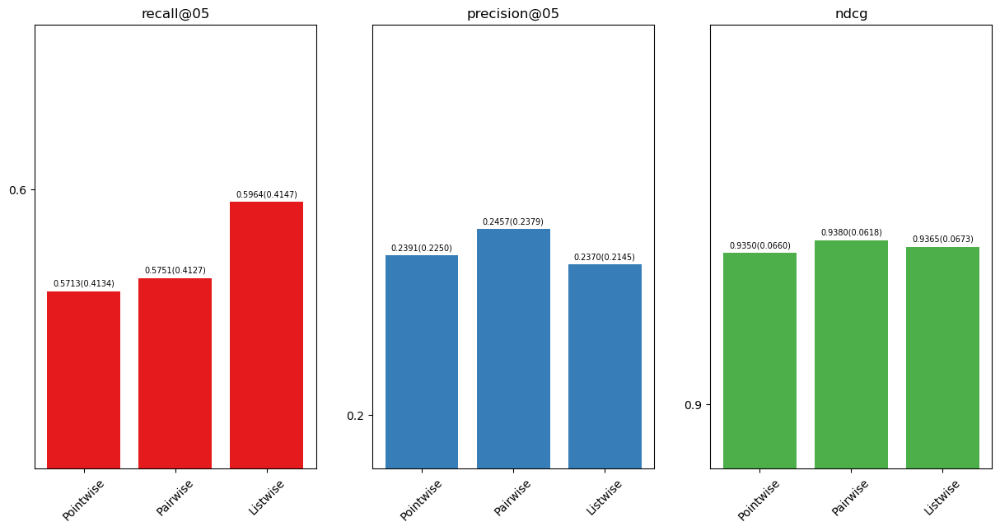
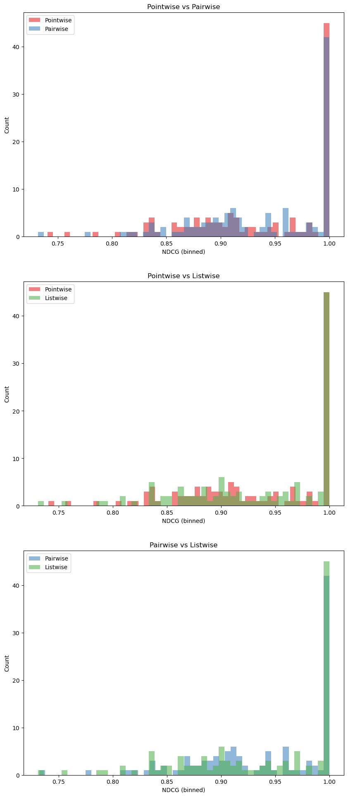

Grading
| Rubrics (pts)   | Points           | Feedback         |
| --------------- | ---------------- | ---------------- |
| Features/losses (2*5pts) | 9| a bit better motivation could be done |
| Implementation (2*5pts)  | 8   | the generation of the two extra features should be in analysis_scipt.py (-2)|
| Reproduction (5pts)      | 5   | code seems fine |
| Results Analysis (10pts) | 3    | you should have compared how each extra feature performs against the baseline. this is what this experiment was for.  |
| Per Q Results (10pts)    | 5    | discussion analysis missing. we expected you to analyze the different features added and how they help or dont for each query |


# Overview

In the analysis portion of this assignment, we provide you with a range of IR scenarios to choose from. For each scenario we also provide a dataset. Your task is to pick one scenario, and propose and implement useful features and/or losses based on user needs in that scenario. For example, for some use cases, precision at the very top ranks might be more relevant than recall and vice versa.

In this part of the assignment, you can points for proposing and implementing a new feature or loss, up to a maximum of 45 points. You can draw inspiration from features, losses, and metrics implemented in course assignments, course readings, or scientific literature more broadly. You **must cite your sources of inspiration**. For full credit, you can implement two new features, two new losses, or one new feature and one new loss. Detailed breakdown of the points you can gain:

1. (2x5) **Proposal**. Every proposal of a feature or loss must be well-motivated by theory or previous research. If a feature or loss is a slight modification of existing features you have implemented in the first part of this assignment, you gain up to 2 points; if your feature or loss is more creative, you can gain up to 5 points.
2. (2x5) **Implementation of features**. You can gain 5 points for each correctly-implemented feature or loss. To receive full credit, your implementation needs to match your description, so that it is clear your implementation is correct.
3. (5) **Implementation of a scenario**. The reproducible implementation of your scenario, including the new features and/or loss, is rewarded with 5 points. We consider an implementation reproducible if you create a script with the path and name `ltr/analysis_script.py` that implements this new scenario and writes the results to an output file `outputs/analysis_res.json`. Your implementation needs to be reproducible; no credit will be awarded if we are unable to easily run your script to obtain the results your reported.
4. (10) **Analysis of results**. Conduct an analysis of the results. Did you expect these results? Do the most important feature or loss make theoretical sense? For this discussion, you can gain 10 points.
5. (10) **Analysis of per-query results**. Some features may greatly boost a few queries that were previously not handled well, whereas other features might give a small boost to many queries. If you analyze these per-query differences and discuss your findings, you can gain 10 points.

## Guidelines

General guidelines:

1. Pick one scenario from the list below. Consider the example information need as inspiration for a use case; you can also come up with your own use case using one of the suggested datasets. A guide to obtaining and using these datasets is available in the `analysis_datasets.ipynb` notebook.
2. Describe what features/loss you chose and why you believe they may lead to improved performance given your dataset and use case. In the description, make sure to include which loss you are using, even if you don't implement a new one. Also include what metric you think is best suited to evaluate the results. Make sure to explain your implementation so that we can reproduce the results. (Fill in _Description of Your Creativity_.)
4. Conduct a thorough analysis of the results, making sure to discuss what worked and what didn't. (Fill in _Your summary_ section.)

## Scenarios
<!-- ### Scenario 1: SEE WHAT COVID IS ALL ABOUT :mask:
Example information need: The pandemic just started, and you're looking up the symptoms of COVID-19.
- Dataset: COVID/
- [Description](https://ir-datasets.com/beir.html#beir/trec-covid): A version of the TREC COVID (complete) dataset.
- Queries: The question variant.
- Documents: Titles and abstracts.

### Scenario 2: HELP WITH GENOMICS RESEARCH :dna:
Example information need: Your friend is writing their master thesis in Genomics and are currently doing their literature search.
- Dataset: GENOMICS/
- [Description](https://ir-datasets.com/medline.html#medline/2004/trec-genomics-2004): The TREC Genomics Track 2004 benchmark. Contains 50 queries with article-level relevance judgments.
- Queries: Natural language questions.
- Documents: Biomedical article titles and abstracts.
- Qrels: Deep, graded.

### Scenario 3: WIN AN ARGUMENT :speech_balloon:
Example information need: You are arguing with your flatmate about whether museums in Amsterdam should be free of charge. Naturally, you want to win the argument.
- Dataset: ARGS/
- [Description](https://ir-datasets.com/argsme.html#argsme/2020-04-01/touche-2021-task-1): Given a question on a controversial topic, retrieve relevant arguments from a focused crawl of online debate portals.
- Queries: Controversial questions in natural language.
- Documents: Excerpts from arguments from online debate portals, including premises and a conclusion.

### Scenario 4: GAME ON :video_game:
Example information need: You are in the middle of your Minecraft game and suddenly want to ask a question. It's late at night and nobody would answer it on the forum, so you search the forum for whether someone else asked your question before.
- Dataset: GAMING/
- [Description](https://ir-datasets.com/beir.html#beir/cqadupstack/gaming): A version of the CQADupStack dataset, for duplicate question retrieval. This subset is from the gaming StackExchange subforum.
- Queries: Natural language.
- Documents: Questions in natural language.
 -->

### Scenario 5: NOURISH YOURSELF :strawberry:
Example information need: You are wondering whether berries prevent muscle soreness and want some expert advice on this.
- Dataset: NUTRITION/
- [Description](https://ir-datasets.com/nfcorpus.html#nfcorpus/train/nontopic): Health-related, filtered to exclude queries from topic pages.
- Queries: Natural language queries (written in non-technical English, harvested from the NutritionFacts.org site).
- Documents: Medical documents (written in a complex terminology-heavy language), mostly from PubMed.
<!-- 
### Scenario 6: DEBUNK HOAXES AROUND CLIMATE CHANGE :earth_americas:

Example information need: Your friend thinks that climate change is not real. You want to convince them otherwise.

- Dataset: CLIMATE/
- [Description](https://ir-datasets.com/beir.html#beir/climate-fever): A version of the CLIMATE-FEVER dataset, for fact verification on claims about climate.
- Queries: Natural language claims on climate change.
- Documents: Documents form the Knowledge Document Collection.

### Scenario 7: LEARN SOME BUSINESS :briefcase:
Example information need: Your idea for an AI startup was a huge success, but somehow you are still short on money. You want to know someone else's opinion on how to start a large business with a not-so-large income.
- Dataset: BUSINESS/
- [Description](https://ir-datasets.com/beir.html#beir/fiqa/train): Financial opinion question answering.
- Queries: Natural language.
- Documents: Financial news and opinion from online sources. -->

# Results table (fill this in)

| Model                                         | R@5  | R@20 | P@5  | NDCG |
|-----------------------------------------------|------|------|------|------|
| Pointwise model with proposed loss+feature(s) | 0.571| 0.865| 0.239| 0.935|
| Pairwise model with proposed loss+feature(s)  | 0.575| 0.849| 0.245| 0.938|
| Listwise model with proposed loss+feature(s)  | 0.596| 0.893| 0.252| 0.940|


*Diagram 1*


*Diagram 2*


----

**For the results analysis, test the performance of the default three models with the new dataset, then add a fourth model with our additional features (concreteness and/or imageability) to highlight how our proposed new feature (or loss) improves the performance of the model.**
----

# Description of Your Creativity (fill this in; max 300 words)

For the additional analysis section of our study, we investigate the effectiveness of the ranking system in the context of debunking hoaxes around climate change. We aim to convince a friend that climate change is real, and we want to provide them with the most convincing documents.

We introduce two new feature metrics to the ranking system. Firstly, "concreteness" as outlined by [Brysbaert et al. (2014)](https://link.springer.com/article/10.3758/s13428-013-0403-5), is the degree to which a word refers to a tangible object or concept. In particular, words which refer to things or actions in reality that can be experienced through the five senses, are called concrete. Analogously, words that refer to abstract concepts or ideas are called abstract.

The second feature is "imageability" which is the ease with which a word can evoke a mental image. Words that are more imageable are easier to remember and understand. This feature was initially introduced by [Paivio et al. (1968)](https://psycnet.apa.org/record/1968-05551-001), and further work carried out by various authors. In our specific case, we make use of the 3000 word norms collected by [Cortese et al. (2004)](https://link.springer.com/article/10.3758/BF03195585).

Both features correlate with the human's ability to understand a concept. Intuitively, higher concreteness and imageability may correlate with documents that will provide a clearer, more straightforward answer for user queries. Consider the following example: "Anthocyanin compounds have been found to alleviate muscular mechanical hyperalgesia" can be a bit harder to understand and/or have a less overlap with a natural language query than "Ingredients in berries linked to decreased muscle soreness".

For both metrics, we score the documents based on the _average_ concreteness and imageability of the words in the document, and use these scores as additional features in our ranking system.

For the loss, we propose the listwise loss as it is the most effective loss function for ranking tasks, as shown in the previous part of the assignment, with NDCG as the target meric for optimization and evaluation.

# Your summary (fill this in; max 250 words)
>
> :memo:

In our study, we compared three different training methodologies for ranking models: pointwise, pairwise, and listwise approaches, focusing on their effectiveness in improving the ranking accuracy. Our findings (see the table and diagrams) reveal that the pointwise method, which evaluates each document in isolation to determine its rank, is the least effective among the three. This is because it does not take into account the relative importance or position of documents in relation to one another which is crucial for accurate ranking.

The pairwise approach performs comparatively better, which we attribute to its strategy of evaluating documents in pairs, thereby directly taking into account their relative positioning. By focusing on the comparison between two documents at a time, it aligns more closely with the inherent objective of ranking tasks, which is to order documents by relevance or importance.

The listwise approach is found to perform similarly with the pairwise technique, enhancing it with the capability to optimize for specific ranking metrics, in this case, the Normalized Discounted Cumulative Gain (NDCG). At *Diagram 2* we can see that the listwise approach achieves the highest number of query results (in our case batch results as well because we use a batch of 1) with close to the ideal NDCG. This targeted optimization allows a document ranking which is more closely aligned with the desired outcome.

# Per Query Analysis

Listwise on 17 features (15 + concretenenss/imageability) outperforms listwise on 15 features on 45 out of 118 queries.

```Text
Top 5 queries with the highest positive difference in NDCG:

NDCG 0.10 Pills vs. diet for erectile dysfunction
NDCG 0.09 Uric acid from meat and sugar
NDCG 0.09 Rooibos & nettle tea
NDCG 0.05 How to gain weight on diet soda
NDCG 0.05 Treating sensitive skin from the inside out

Top 5 queries with the highest negative difference in NDCG:

NDCG -0.03 The anti-wrinkle diet
NDCG -0.00 Best nutrition bang for your buck
NDCG -0.00 Why is selling salmonella-tainted chicken legal ?
NDCG -0.00 Raisins vs. energy gels for athletic performance
NDCG 0.00 Avoiding dairy to prevent parkinson 's
```

We can see that queries likely associated with documents containing more concrete and imageable words have seen the most improvement. This is consistent with our hypothesis that these features would be beneficial in the context of providing clear, straightforward answers to user queries in the context of nutrition.

# References

Brysbaert, M., Warriner, A.B. & Kuperman, V. Concreteness ratings for 40 thousand generally known English word lemmas. Behav Res 46, 904–911 (2014). <https://doi.org/10.3758/s13428-013-0403-5>

Cortese, M.J., Fugett, A. Imageability ratings for 3,000 monosyllabic words. Behavior Research Methods, Instruments, & Computers 36, 384–387 (2004). <https://doi.org/10.3758/BF03195585>

Paivio, A., Yuille, J. C., & Madigan, S. A. Concreteness, imagery, and meaningfulness values for 925 nouns. Journal of Experimental Psychology, 76(1, Pt.2), 1–25 (1968). <https://doi.org/10.1037/h0025327>
